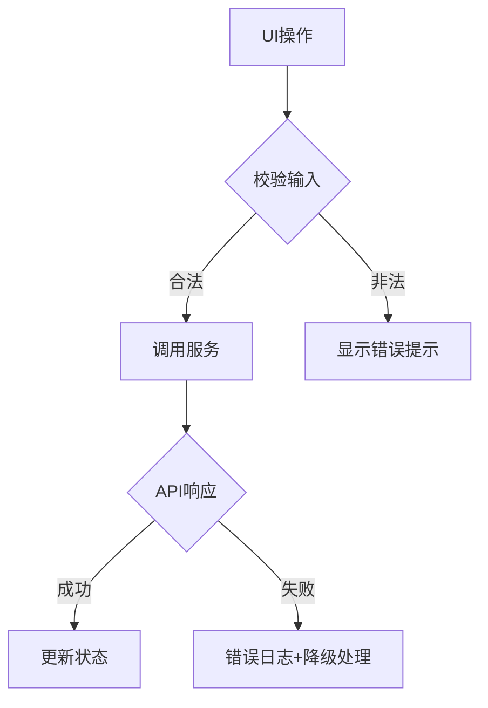
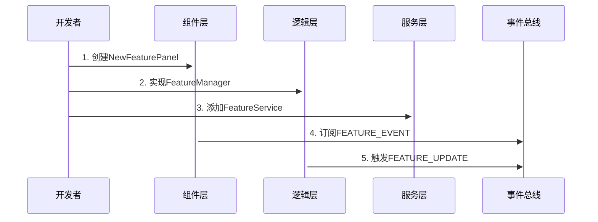

# Obsidian 智能周报插件架构设计文档

## 一、架构设计原则
1. **关注点分离**：组件/逻辑/数据三层分离
2. **单向数据流**：Editor → Panel → Manager → Storage
3. **最小化耦合**：通过事件总线通信（EventBus）
4. **可测试性**：核心逻辑无UI依赖

## 二、核心架构
```tree
src/
├── agents/          # AI业务逻辑层
│   └── AIAgent.ts   # AI提示工程核心
├── components/      # 展示组件
│   ├── panels/      # 业务面板
│   └── ui/          # 通用UI组件
├── managers/        # 数据管理
│   └── SummaryManager.ts # 版本存储中枢
├── services/        # 基础设施
│   ├── api.ts       # 网络服务
│   └── eventBus.ts  # 事件通信系统
├── types/           # 类型定义
└── main.ts          # 插件生命周期
```

## 三、关键设计决策
### 1. 状态管理方案
```typescript
// 采用响应式数据流
class SummaryManager {
  private _summaries: Summary[] = [];
  private listeners = new Set<Listener>();
  
  // 数据变更时通知所有订阅者
  private notify() {
    this.listeners.forEach(l => l(this._summaries));
  }
}
```

### 2. 异常处理策略


### 3. 性能优化点
- **防抖处理**：编辑器输入500ms延迟保存
- **缓存策略**：AI结果本地缓存（LRU算法）
- **懒加载**：面板按需渲染

## 四、模块通信协议
### 1. 事件类型
| 事件名称             | 触发时机                | 载荷格式           |
|----------------------|-------------------------|--------------------|
| VERSION_CREATED      | 新版本生成完成          | { id, timestamp }  |
| CONTENT_UPDATED      | 内容修改并保存          | { id, content }    |
| ANALYSIS_COMPLETED   | 文本分析结果返回        | AnalysisResult     |

### 2. 订阅示例
```typescript
// 组件内订阅数据变更
this.subscription = summaryManager.subscribe((summaries) => {
  this.renderVersions(summaries);
});
```

## 五、重构指南
### 1. 安全修改区域
- `components/ui/` 通用UI组件
- `services/api.ts` 网络层实现
- `types/*` 类型定义

### 2. 高风险区域
| 模块                 | 风险等级 | 影响范围         |
|----------------------|----------|------------------|
| SummaryManager.ts    | 高       | 数据持久化一致性 |
| AIAgent.ts           | 中       | AI输出格式       |
| WeeklySummaryPanel.ts| 高       | 用户交互核心     |

### 3. 测试策略
```typescript
// 数据层测试示例
test('SummaryManager应自动归档旧版本', async () => {
  const manager = new SummaryManager();
  // 添加6个版本
  // 验证是否只保留5个最新版本
});

// UI层测试示例
test('版本对比视图应高亮差异内容', () => {
  render(<VersionCompare old={v1} new={v2} />);
  expect(screen.getByText(/新增内容/)).toHaveStyle('color: green');
});
```

## 六、维护记录
| 日期       | 变更类型 | 影响模块         | 摘要               |
|------------|----------|------------------|--------------------|
| 2024-02-20 | 新增     | TextAnalysisPanel | 添加文本分析功能   |
| 2024-02-18 | 优化     | AIAgent         | 改进多语言提示词   |

## 七、扩展示例
### 添加新功能流程


> 文档版本：2.0.0 | 最后更新：2024-02-20 | 维护者：Kagura Chen 