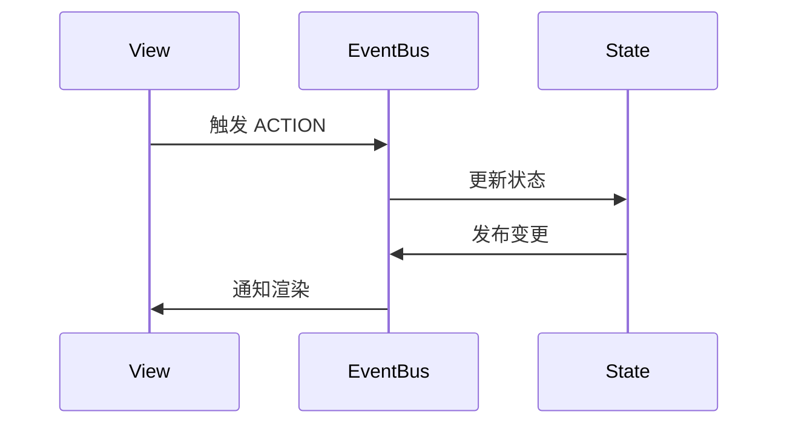
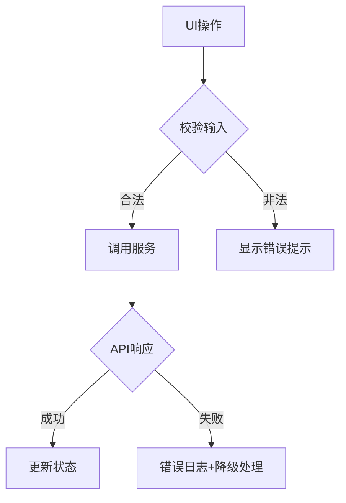
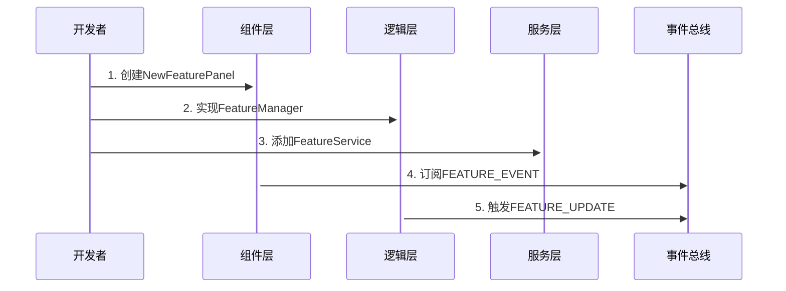
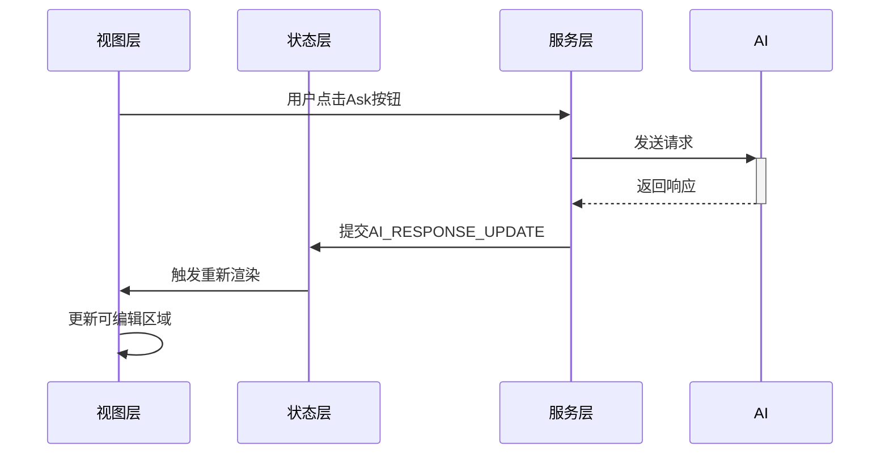

# Obsidian 智能周报插件架构设计文档

## 一、架构设计原则
1. **分层架构**：视图层/状态层/服务层严格分离
2. **响应式数据流**：State → View → Action → State
3. **事件驱动**：通过 EventBus 实现跨模块通信
4. **类型安全**：使用 TypeScript 高级类型
5. **可观测性**：状态变更可追踪/可调试

## 二、核心架构
```tree
src/
├── agents/          # AI业务逻辑层
│   └── AIAgent.ts   # AI提示工程核心
├── components/      # 展示组件
│   ├── panels/      # 业务面板
│   └── ui/          # 通用UI组件
├── managers/        # 数据管理
│   └── SummaryManager.ts # 版本存储中枢
├── services/        # 基础设施
│   ├── api.ts       # 网络服务
│   └── eventBus.ts  # 事件通信系统
├── types/           # 类型定义
└── main.ts          # 插件生命周期
```

## 三、关键设计决策
### 1. 状态管理方案（响应式）
```typescript
// 采用响应式数据流
class SummaryManager {
  private _summaries: Summary[] = [];
  private listeners = new Set<Listener>();
  
  // 数据变更时通知所有订阅者
  private notify() {
    this.listeners.forEach(l => l(this._summaries));
  }
}
```

### 2. 事件驱动架构


### 3. 异常处理策略


### 4. 性能优化点
- **防抖处理**：编辑器输入500ms延迟保存
- **缓存策略**：AI结果本地缓存（LRU算法）
- **懒加载**：面板按需渲染
- **局部加载**：修改操作仅影响原文区域
- **加载状态管理**：分析过程显示动画提示
- **滚动优化**：
  - 分区独立滚动容器
  - 惯性滚动支持
  - 滚动条按系统主题适配
  - 动态内容加载（滚动至底部自动加载）

### 3. 性能优化增强
- **增量更新**：使用 Virtual DOM 差异算法
- **选择器缓存**：记忆化状态选择器
- **请求合并**：并行 AI 请求批处理
- **渲染优化**：
  - 使用 CSS Containment 隔离渲染区域
  - 避免布局抖动（Layout Thrashing）
  - 离屏 Canvas 预渲染

## 四、模块通信协议
### 1. 事件类型
| 事件名称             | 触发时机                | 载荷格式           |
|----------------------|-------------------------|--------------------|
| VERSION_CREATED      | 新版本生成完成          | { id, timestamp }  |
| CONTENT_UPDATED      | 内容修改并保存          | { id, content }    |
| ANALYSIS_COMPLETED   | 文本分析结果返回        | AnalysisResult     |

### 2. 新增事件类型
| 事件名称             | 触发时机                | 载荷格式                  |
|----------------------|-------------------------|---------------------------|
| AI_RESPONSE_UPDATE   | AI回答更新              | { content: string }       |
| AI_REQUEST_START     | AI请求开始              | { question: string }      |
| AI_REQUEST_FAIL      | AI请求失败              | { error: Error }          |
| EDITOR_STATE_CHANGE  | 编辑状态变更            | { isDirty: boolean }      |

### 3. 订阅示例
```typescript
// 组件内订阅数据变更
this.subscription = summaryManager.subscribe((summaries) => {
  this.renderVersions(summaries);
});
```

## 五、重构指南
### 1. 安全修改区域
- `features/*/panels/` 业务面板视图
- `services/StateManager.ts` 状态实现
- `types/*` 类型定义扩展

### 2. 高风险区域
| 模块                 | 风险等级 | 影响范围         |
|----------------------|----------|------------------|
| StateManager.ts      | 高       | 数据一致性       |
| AIEventBus.ts        | 中       | 跨模块通信       |
| AIPanelState.ts      | 高       | 状态序列化       |

### 3. 测试策略增强
```typescript
// 数据层测试示例
test('SummaryManager应自动归档旧版本', async () => {
  const manager = new SummaryManager();
  // 添加6个版本
  // 验证是否只保留5个最新版本
});

// UI层测试示例
test('版本对比视图应高亮差异内容', () => {
  render(<VersionCompare old={v1} new={v2} />);
  expect(screen.getByText(/新增内容/)).toHaveStyle('color: green');
});

// 状态管理测试
test('状态更新应触发订阅者', () => {
  const manager = new StateManager();
  const mockListener = jest.fn();
  
  manager.subscribe(mockListener);
  manager.updateState(/*...*/);
  
  expect(mockListener).toHaveBeenCalledWith(expect.any(Object));
});

// 事件总线测试
test('事件订阅应正确处理载荷', async () => {
  const bus = new AIEventBus();
  const handler = jest.fn();
  
  bus.on('AI_RESPONSE_UPDATE', handler);
  bus.emit('AI_RESPONSE_UPDATE', { content: 'test' });
  
  await nextTick();
  expect(handler).toHaveBeenCalledWith({ content: 'test' });
});
```

## 六、维护记录
| 日期       | 变更类型 | 影响模块         | 摘要               |
|------------|----------|------------------|--------------------|
| 2024-02-20 | 新增     | TextAnalysisPanel | 添加文本分析功能   |
| 2024-02-18 | 优化     | AIAgent         | 改进多语言提示词   |
| 2024-02-21 | 优化     | TextAnalysisPanel | 添加加载状态指示器 |
| 2024-02-23 | 优化     | TextAnalysisPanel | 固定面板尺寸+滚动优化 |
| 2024-02-25 | 重构     | AskAIPanel       | 引入状态管理       |
| 2024-02-26 | 新增     | AIEventBus       | 实现类型安全事件总线 |
| 2024-02-27 | 优化     | StateManager     | 添加选择器缓存     |

## 七、扩展示例
### 添加新功能流程




## 八、性能监控
```typescript
// 性能埋点示例
const metrics = {
  renderTime: 0,
  stateUpdates: 0,
  eventCounts: new Map<string, number>()
};

// 使用 Performance API 监控
const measureRender = () => {
  performance.mark('renderStart');
  
  // 渲染逻辑...
  
  performance.mark('renderEnd');
  performance.measure('render', 'renderStart', 'renderEnd');
  metrics.renderTime = performance.getEntriesByName('render')[0].duration;
};
```

## 九、架构路线图
1. **v1.1** 状态持久化（IndexedDB）
2. **v1.2** 开发者工具集成（Redux DevTools 风格）
3. **v1.3** 服务端渲染（SSR）支持
4. **v2.0** 插件间通信协议
